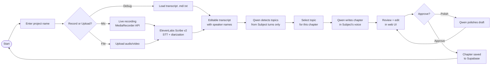

# MemoryLabs

**Turn a family conversation into a memoir chapter — in the interviewee's own voice.**

AI Hackathon · Hamburg · June 2026

---

## Demo

[Watch the demo](https://drive.google.com/file/d/12_9Oo39b1ON3Ocr6UtH2FVxxaE142Pth/view?usp=sharing)

---

## What It Does

Record (or upload) a conversation with an elderly family member. MemoryLabs transcribes it with speaker diarization, detects the topics they talked about, and writes a memoir chapter in their voice. A moderator reviews and approves. Repeat per session, per chapter.

```
Record a conversation  →  AI transcribes + diarizes  →  Pick a topic
                                                              ↓
                                          AI writes the chapter in their voice
                                                              ↓
                                             Review · Edit · Approve · Repeat
```

---

## User Flow



---

## AI Pipeline

```
Audio file / mic stream
        │
        ▼
┌─────────────────────────────┐
│  ElevenLabs Scribe v2       │  STT with speaker diarization
│  model: scribe_v2           │  → timestamped segments per speaker
│  diarize: true              │
└─────────────┬───────────────┘
              │  diarized transcript JSON
              ▼
┌─────────────────────────────┐
│  Qwen  qwen3.6-max-preview  │  Pass 1 — Topic detection
│  (Subject turns only)       │  → topic list with confidence labels
└─────────────┬───────────────┘
              │  selected topic
              ▼
┌─────────────────────────────┐
│  Qwen  qwen3.6-max-preview  │  Pass 2 — Chapter generation
│  full transcript context    │  → title + prose in Subject's voice
│  + speaker voice profile    │
└─────────────┬───────────────┘
              │  (optional)
              ▼
┌─────────────────────────────┐
│  Qwen  qwen3.6-max-preview  │  Pass 3 — Polish on demand
│  chapter draft as input     │  → refined final draft
└─────────────────────────────┘
```

The voice fingerprint is implicit: Qwen receives the full diarized transcript and is instructed to preserve the Subject's vocabulary, sentence rhythm, and tone — no separate word-bank file needed.

---

## Architecture

```
Browser (Vanilla JS, no bundler)
    │
    │  /netlify/functions/transcribe   POST audio → ElevenLabs API
    │  /netlify/functions/qwen         POST messages → DashScope API
    │
    ├── Netlify (static hosting + serverless functions)
    │       AI keys live server-side only — never in the browser
    │
    └── Supabase (PostgreSQL via JS CDN client)
            Tables: recordings · chapters · parked_topics
            Loaded on startup, written on each save
```

**Key design choices:**
- No bundler, no framework — single `index.html` + `styles.css` + `script.js`
- API keys: enter your own in the UI for local use; leave blank on the hosted site (proxied by Netlify functions)
- Debug mode: skip STT entirely by loading a `.md`/`.txt` transcript file

---

## Project Structure

```
MemoryLabs/
│
├── index.html                  # App shell — all 5 screens in one file
├── styles.css                  # Brand styles (Plus Jakarta Sans, #CC2222)
├── script.js                   # All app logic (~1 400 lines, no deps)
├── logo.png                    # Brand logo (transparent PNG)
│
├── config.js                   # ← gitignored. Copy from config.example.js
├── config.example.js           # Template: paste your Supabase URL + anon key
├── supabase-schema.sql         # Run once in Supabase SQL editor to create tables
│
├── netlify.toml                # Build command + functions dir + Node version
├── scripts/
│   └── gen-config.js           # Build step: writes config.js from env vars
│
├── netlify/functions/
│   ├── transcribe.js           # ElevenLabs Scribe v2 proxy (audio bytes → JSON)
│   └── qwen.js                 # DashScope proxy (messages[] → completion)
│
└── Planning/
    └── scope-v1.md             # Product scope & pipeline design doc
```

### `script.js` internals

```
Constants & mock data       lines   1–  70
DOM element refs (el.*)          70– 115
State variables                 115– 130
─────────────────────────────────────────
Screen / step rendering         130– 200
Recording (MediaRecorder)       200– 520
Upload + transcription          520– 620
Transcript rendering            620– 720
─────────────────────────────────────────
Qwen: topic detection           720– 800
Qwen: chapter writing           800– 940
Qwen: chapter polishing         940–1000
─────────────────────────────────────────
Supabase: save / load           1000–1100
Sidebar (chapters/recordings/   1100–1280
  parking lot)
─────────────────────────────────────────
Event listeners                 1280–1430
```

---

## Local Setup

```bash
# 1. Clone
git clone https://github.com/matthieu-labs/MemoryLabs.git
cd MemoryLabs

# 2. Configure Supabase
cp config.example.js config.js
# Edit config.js and paste your Supabase Project URL + anon key

# 3. Run the schema
# Open Supabase → SQL editor → paste supabase-schema.sql → Run

# 4. Open
open index.html   # or serve with: npx serve .
```

Paste your **ElevenLabs** and **Qwen (DashScope)** API keys in the UI when prompted.  
On the hosted site, leave both fields blank — calls go through the Netlify proxies.

---

## Deploy on Netlify

1. Connect this repo in Netlify (or run `netlify deploy`).
2. Add environment variables under **Site settings → Environment variables**:

| Variable | Scope | Used by |
|---|---|---|
| `SUPABASE_URL` | Build + Runtime | Browser (written into `config.js` at build time) |
| `SUPABASE_ANON_KEY` | Build + Runtime | Browser |
| `ELEVENLABS_API_KEY` | Runtime | `netlify/functions/transcribe` |
| `QWEN_API_KEY` | Runtime | `netlify/functions/qwen` |

3. Deploy. Done.

> Netlify synchronous functions cap request bodies at ~6 MB. Use short audio clips (< 2 min) for live demos. Longer sessions need a signed-upload flow.

---

## Tech Stack

| Layer | Tool |
|---|---|
| Frontend | Vanilla JS, HTML, CSS — no bundler |
| Font | Plus Jakarta Sans (Google Fonts) |
| STT | ElevenLabs Scribe v2 |
| AI | Qwen qwen3.6-max-preview (DashScope) |
| Persistence | Supabase (PostgreSQL) |
| Hosting | Netlify (static + serverless functions) |

---

## Roadmap (out of v1 scope)

- Self-improving voice fingerprint (edits feed back into style profile)
- Multiple chapters from one recording
- Family context / family tree input
- Source tracing: audio timestamp ↔ sentence
- Native mobile app for one-tap recording
- Physical book export (PDF / print-on-demand)
